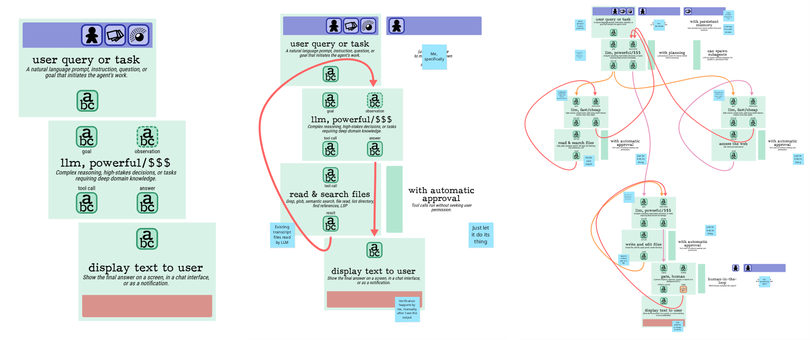

# Generominos, Agentic AI Edition

Learn more about the original Generominos cards at [github.com/galaxykate/generominos](https://github.com/galaxykate/generominos) and [galaxykate.com/generominos](https://www.galaxykate.com/generominos/)!

This is a new set of Generominos cards specifically to explore agentic AI pipelines.  There's no fun stuff like turning Kinects into some kind of fire display!

## New cards

The scenario cards are all scenarios for user research, UX research, product discovery, etc.-type tasks.

There's a new "dark" scenario variant card, with a fixed dark background color and white text, that is used for cards that are _only_ constraints; in this case, AI harnesses.  Provided harnesses are Visual Studio Code local agent, GitHub Copilot CLI, and GitHub Copilot cloud agent, with capabilities accurate as of early June 2026.

The only input card is "user query or task," which provides your prompt to the LLM.  The only output card is "display text to user."

Transform cards represent your choice of LLM, callable tools, and gates/checkpoints.  All only take text as input and return text as output, because LLMs are just bags of words.

Input modifiers represent stakeholders, memory, and events/triggers.

Output modifiers represent memory.

There is a new "transform modifier" card which applies a specific constraint to the LLM, tool, or checkpoint card.

## Use

If you don't have a color printer, card stock, and a paper cutter, I've had success taking the printable PDF to my local FedEx Office and having them print print and cut it.  Note they will have to set it up to be manually cut; there isn't enough white space between the cards to have it done automatically.  It's a lot cheaper to print a lot of decks than to print just one; the setup fee is expensive compared to the printing fee.

## Updated files

Unused files and references were removed.

The legacy Puppeteer card output code was replaced with client-side JavaScript.  It still has to be hosted on a web server, but just one that serves static files, and it'll give you a `.zip` file with all the card images in it.

To generate a PDF, use your browser's print-to-PDF or save-as-PDF function, with 0.25" margins, and scale down to around 46%.

Input cards can now have more than one modifier socket type.

## Caveats

Transform modifiers are hard-coded to be text modifiers.

## Licensing

The original code in this repository is licensed Apache 2.0.

The vendored dependencies are licensed:

- jQuery 2.1.4: MIT
- dom-to-image-more 3.10.0: MIT
- JSZip 3.10.1: MIT (or GPLv3)
- FileSaver 2.0.5: MIT

Per the Generominos printable PDF, the PDF and the cards themselves are licensed Creative Commons Attribution-ShareAlike 4.0 International.

Note: the `index.html` file, which is mostly a duplicate of Kate Compton's web page about Generominos, states Generominos are licensed Creative Commons Attribution-NonCommercial-ShareAlike 4.0 International.  However, the printable PDF itself, and the code that generates it, have always stated CC-BY-SA, without the non-commercial restriction.
